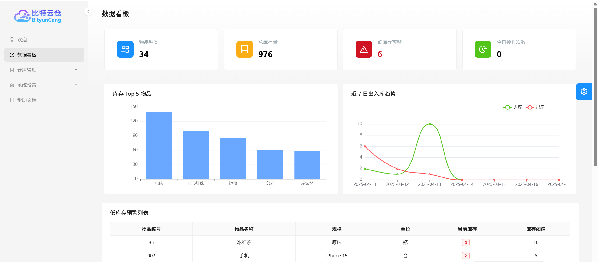

# BityunCang - Intelligent Warehouse Management System

[](https://opensource.org/licenses/MIT)

This project is developed by [@Steve2457](https://github.com/Steve2457) and [@Sleepless-cloud](https://github.com/Sleepless-cloud).

BityunCang is an intelligent warehouse management system designed to simplify warehouse operations and improve management efficiency. Whether for small organizations or large logistics centers, BityunCang makes it easy to manage inventory, track item movement, and optimize warehouse operations.


## Features

*   Inventory Management
*   Item Tracking
*   Operation Optimization
*   User & Role Management
*   AI-Powered Insights (Optional)

## Screenshots

**Dashboard:**


**Items Management:**


## Technology Stack

*   **Frontend**: React, Ant Design Pro, TypeScript, HTML, CSS, Node.js (Build Tooling)
*   **Backend**: Java, Spring Boot, MyBatis
*   **Database**: MySQL
*   **Development Tools**: Visual Studio Code, Gradle

## Setup

1.  **Database Setup**:
    *   Ensure you have MySQL installed and running.
    *   Execute the SQL scripts located in the `web-backend/data` directory to create the necessary tables and initial data.

2.  **Backend Setup**:
    *   Make sure you have a Java Development Kit (JDK) installed.
    *   Navigate to the `web-backend` directory.
    *   Compile and run the backend application using the main class: `web-backend/src/main/java/redlib/backend/WebBackendApplication.java`. You can typically run this using your IDE or via Gradle commands (e.g., `./gradlew bootRun`).

3.  **Frontend Setup**:
    *   Ensure you have Node.js and npm (or pnpm/yarn) installed.
    *   Navigate to the `web-frontend-master` directory.
    *   Install dependencies:
        ```bash
        npm install
        # or pnpm install / yarn install
        ```

4.  **AI Feature Configuration (Optional)**:
    *   This system integrates with AI large language models to provide enhanced insights.
    *   To enable AI features, you need to configure your API keys.
    *   API keys should be stored in `.env` files for security, not hardcoded in source code.
    *   **Backend:**
        Create a file named `.env` in the `web-backend` directory and add:
        ```
        ZHIPU_API_KEY=your_zhipu_api_key_here
        ```
        The backend will automatically read this environment variable.
    *   **Frontend:**
        Create a file named `.env` in the `web-frontend-master` directory and add:
        ```
        VITE_AMAP_WEATHER_KEY=your_amap_weather_key_here
        ```
        The frontend will use `import.meta.env.VITE_AMAP_WEATHER_KEY` to access the key.

## Running the Application

1.  Start the backend server (as described in Backend Setup step 2).
2.  Start the frontend development server:
    *   Navigate to the `web-frontend-master` directory.
    *   Run the command:
        ```bash
        npm run start
        ```
3.  Open your web browser and go to the `localhost` address provided by the `npm run start` command (usually `http://localhost:3000` or similar). You should see the BityunCang login page or dashboard.

    <!-- Placeholder for application running screenshot removed -->

---

# 比特云仓（BityunCang） - 智能仓库管理系统

[](https://opensource.org/licenses/MIT)

该项目由[@Steve2457](https://github.com/Steve2457) 和 [@Sleepless-cloud](https://github.com/Sleepless-cloud)共同开发。

比特云仓（BityunCang）是一款智能仓库管理系统，旨在简化仓库操作，提高管理效率。无论是小型机构还是大型物流中心，您都可以通过比特云仓轻松管理库存、追踪物品流动，并优化仓库运营。


## 主要功能

*   库存管理
*   物品追踪
*   操作优化
*   用户与权限管理
*   AI 智能分析 (可选)

## 界面截图

**数据看板:**


**物品管理:**


## 技术栈

*   **前端**: React, Ant Design Pro, TypeScript, HTML, CSS, Node.js (构建工具)
*   **后端**: Java, Spring Boot, MyBatis
*   **数据库**: MySQL
*   **开发工具**: Visual Studio Code, Gradle

## 环境设置

1.  **数据库设置**:
    *   确保你已安装并运行 MySQL。
    *   执行位于 `web-backend/data` 目录下的 SQL 脚本，以创建所需的数据库表和初始数据。

2.  **后端设置**:
    *   确保你已安装 Java 开发工具包 (JDK)。
    *   进入 `web-backend` 目录。
    *   编译并运行后端应用程序，主类位于：`web-backend/src/main/java/redlib/backend/WebBackendApplication.java`。通常可以使用你的 IDE 或 Gradle 命令（例如 `./gradlew bootRun`）来运行。

3.  **前端设置**:
    *   确保你已安装 Node.js 和 npm (或 pnpm/yarn)。
    *   进入 `web-frontend-master` 目录。
    *   安装依赖：
        ```bash
        npm install
        # 或 pnpm install / yarn install
        ```

4.  **AI 功能配置 (可选)**:
    *   本系统集成了 AI 大模型功能以提供增强的分析能力。
    *   为了安全，API 密钥现在存储在 `.env` 文件中，不再直接写在源码里。
    *   **后端：**
        在 `web-backend` 目录下新建 `.env` 文件，内容如下：
        ```
        ZHIPU_API_KEY=你的智谱API密钥
        ```
        后端会自动读取该环境变量。
    *   **前端：**
        在 `web-frontend-master` 目录下新建 `.env` 文件，内容如下：
        ```
        VITE_AMAP_WEATHER_KEY=你的高德天气API密钥
        ```
        前端通过 `import.meta.env.VITE_AMAP_WEATHER_KEY` 访问密钥。

## 运行应用程序

1.  启动后端服务器（参照"后端设置"第 2 步）。
2.  启动前端开发服务器：
    *   进入 `web-frontend-master` 目录。
    *   运行命令：
        ```bash
        npm run start
        ```
3.  打开你的网络浏览器，访问 `npm run start` 命令提供的 `localhost` 地址（通常是 `http://localhost:3000` 或类似地址）。您应该能看到比特云仓的登录页面或仪表盘。

    <!-- 应用程序运行截图占位符已移除 -->